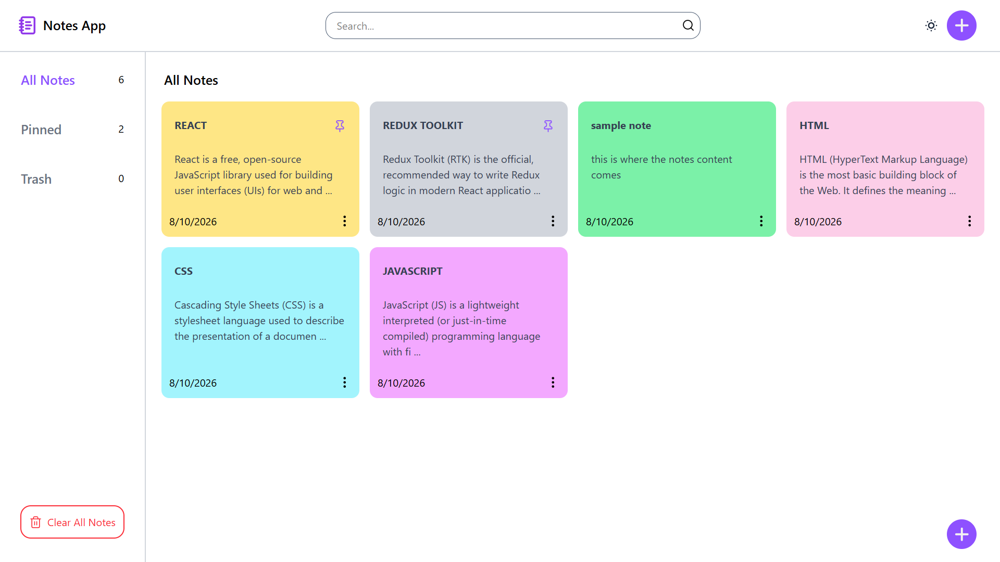
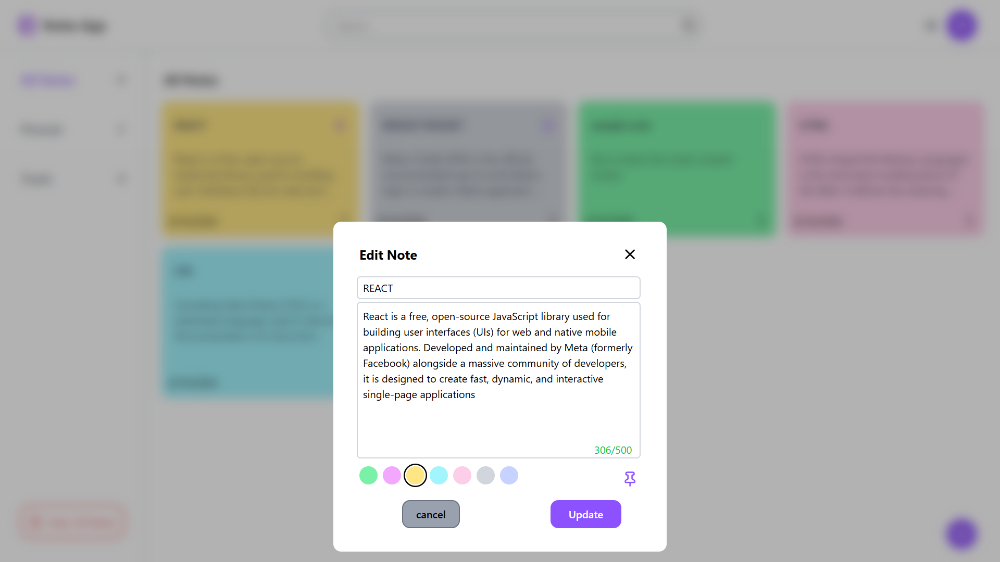
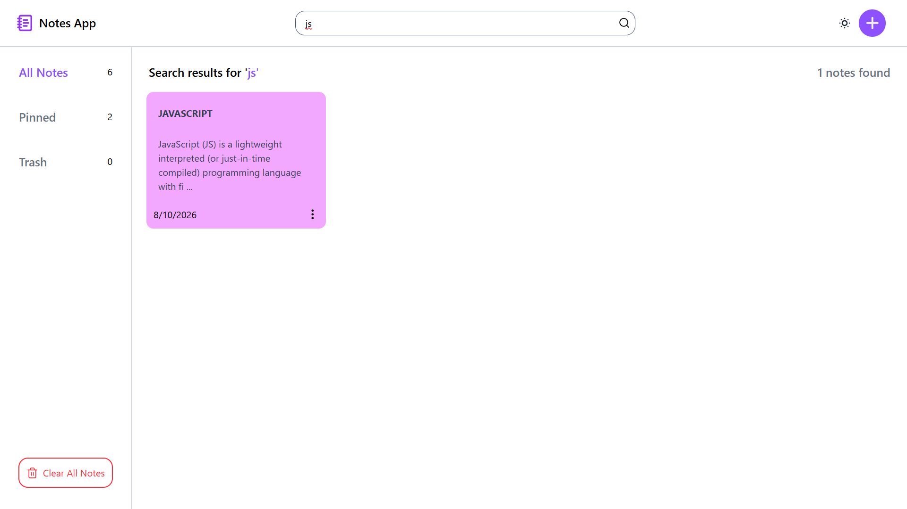
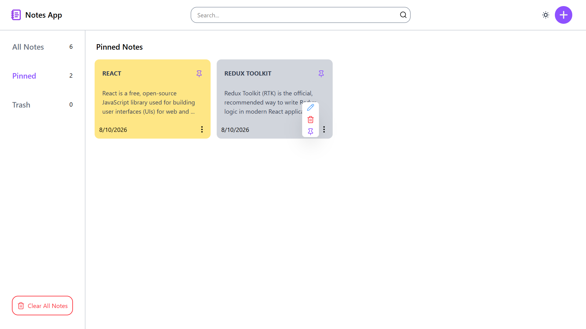
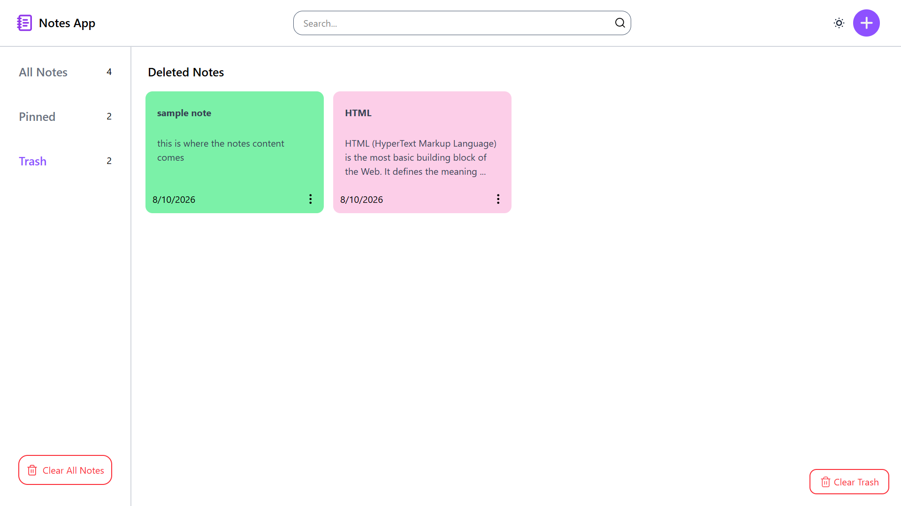
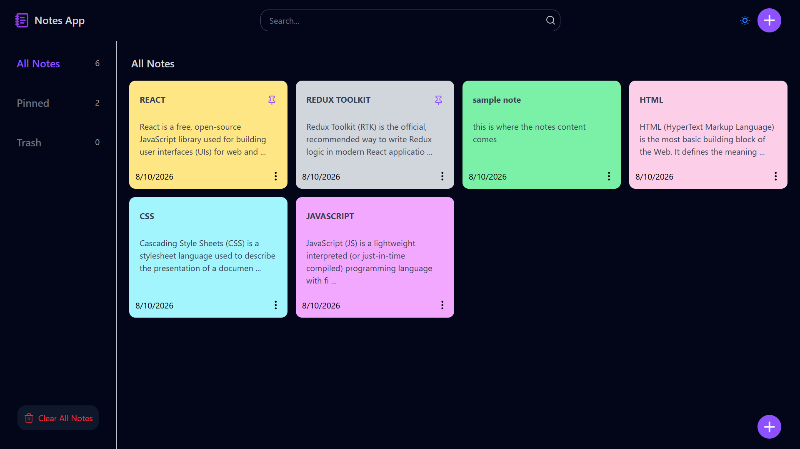
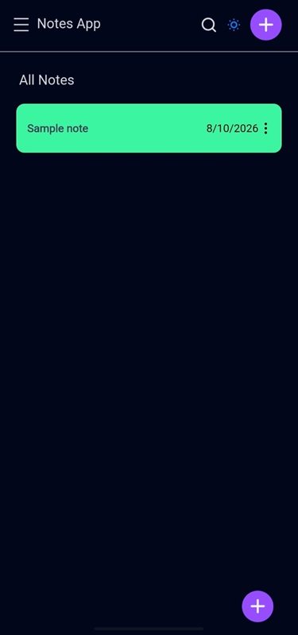
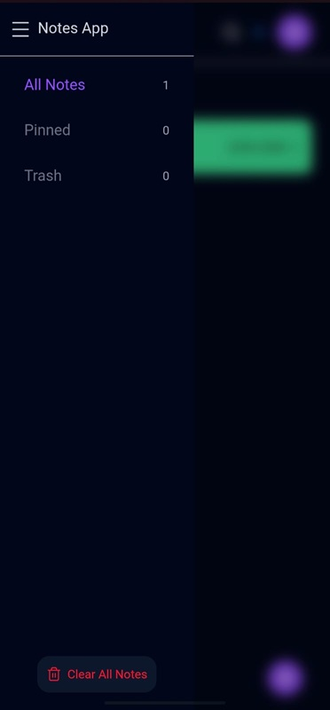

# 📝 Notes App

A responsive note-taking application built with **React**, **Redux Toolkit**, **React Router**, and **Tailwind CSS**.

The app provides a complete client-side note management experience with search, pinning, trash management, theme preferences, and Local Storage persistence.

## 🚀 Live Demo

[**Open Notes App →**](https://notes-app-umber-chi-34.vercel.app/)

## ✨ Features

- Create notes
- Edit notes
- Delete notes using a Trash system
- Restore deleted notes
- Permanently delete notes
- Clear all notes
- Pin and unpin notes
- Pinned notes page
- Search notes by title and content
- Custom note colors
- Character counter and maximum content length
- Note creation and detailed note-view modals
- Light and dark mode
- Persist notes using Local Storage
- Persist theme preference using Local Storage
- Responsive desktop and mobile layouts
- Mobile sidebar navigation
- Responsive note grid
- Empty states for All Notes, Pinned Notes, and Trash
- Automatic ordering of pinned notes before unpinned notes
- Client-side navigation with React Router

## 🛠️ Tech Stack

### Frontend
- **React**
- **React Router**
- **Redux Toolkit**
- **React Redux**
- **Tailwind CSS**
- **Lucide React**

### Development
- **Vite**
- **ESLint**

### Storage
- **Browser Local Storage**

## 🧠 State Management

Redux Toolkit is used to manage application state through separate slices:

### Notes Slice
Handles:
- Adding notes
- Updating notes
- Pinning and unpinning
- Soft deletion
- Restoring notes
- Permanent deletion
- Clearing notes

### UI Slice
Handles:
- Create/edit modal state
- View-note modal state
- Selected note ID
- Search state
- Mobile sidebar state
- Theme preference

## 🗑️ Trash System

Deleted notes use a soft-delete approach instead of being immediately removed.

A deleted note is marked with:

```js
isDeleted: true
```

This allows the note to appear in Trash and be restored later.

Notes can also be permanently deleted from Trash.

## 🔍 Search

The search feature checks both the **title** and **content** of notes and updates the results as the user types.

## 📌 Pinning

Notes can be pinned from the note card, note view, and note creation/editing interface.

Pinned notes are available through the dedicated **Pinned** page and are displayed before unpinned notes in the main notes list.

## 🌙 Theme

The application supports light and dark themes.

The selected theme is stored in Redux UI state and persisted in Local Storage so the preference remains after refreshing or reopening the application.

## 💾 Local Storage

Local Storage is used to persist:

- Notes
- Theme preference

This allows the application to work without a backend while retaining data between sessions.

## 📱 Responsive Design

The UI adapts to different screen sizes.

### Desktop
- Persistent sidebar
- Multi-column notes grid
- Expanded note previews
- Desktop navigation

### Mobile
- Collapsible sidebar
- Single-column notes
- Responsive modals
- Mobile-friendly navigation and controls

## 🧭 Routing

React Router is used for page navigation.

| Route | Page |
|---|---|
| `/` | All Notes |
| `/pinned` | Pinned Notes |
| `/trash` | Trash |

The shared layout contains the Header and Sidebar, while the active page is rendered through the router outlet.

## 📂 Project Structure

```text
src/
├── app/
│   └── store.js
├── components/
│   ├── CreateNote.jsx
│   ├── Header.jsx
│   ├── NoteCard.jsx
│   ├── Notes.jsx
│   ├── SearchNote.jsx
│   ├── Sidebar.jsx
│   └── ViewNote.jsx
├── constants/
│   └── noteColors.js
├── features/
│   ├── notes/
│   │   └── notesSlice.js
│   └── ui/
│       └── uiSlice.js
├── pages/
│   ├── Home.jsx
│   ├── Pinned.jsx
│   └── Trash.jsx
├── utils/
│   └── localStorage.js
├── App.jsx
├── index.css
└── main.jsx
```

## ⚙️ Getting Started

### Prerequisites

- Node.js
- npm

### Installation

Clone the repository:

```bash
git clone https://github.com/gixxing/Notes-App.git
```

Navigate into the project:

```bash
cd Notes-App
```

Install dependencies:

```bash
npm install
```

Start the development server:

```bash
npm run dev
```

## 📦 Production Build

Build the application:

```bash
npm run build
```

Preview the production build:

```bash
npm run preview
```

## 🔎 Linting

Run ESLint:

```bash
npm run lint
```

## 📸 Screenshots

### All Notes



### Create / Edit Note



### Search



### Pinned Notes



### Trash



### Dark Mode



### Mobile




## 👨‍💻 Author

**Gix**

- GitHub: [@gixxing](https://github.com/gixxing)
- Repository: [Notes App](https://github.com/gixxing/Notes-App)
